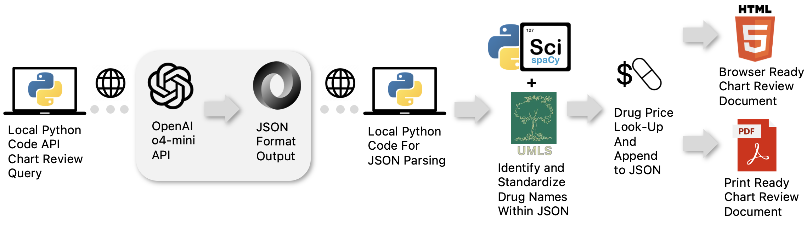
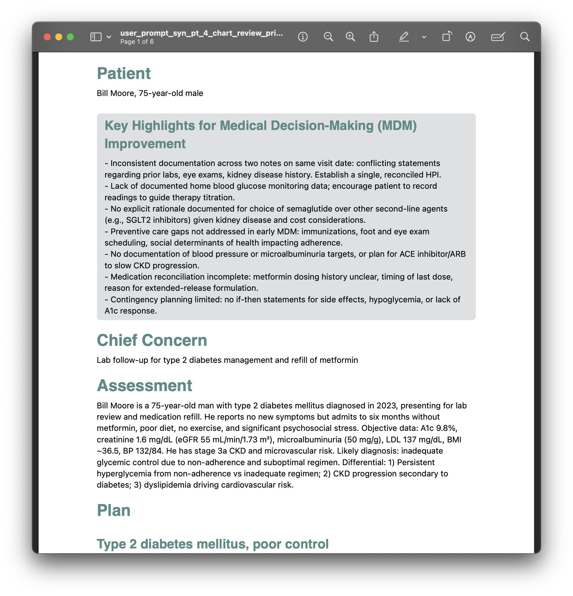
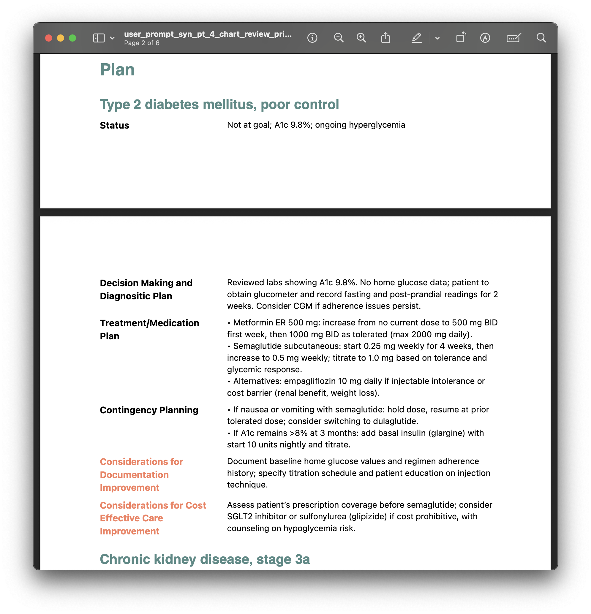
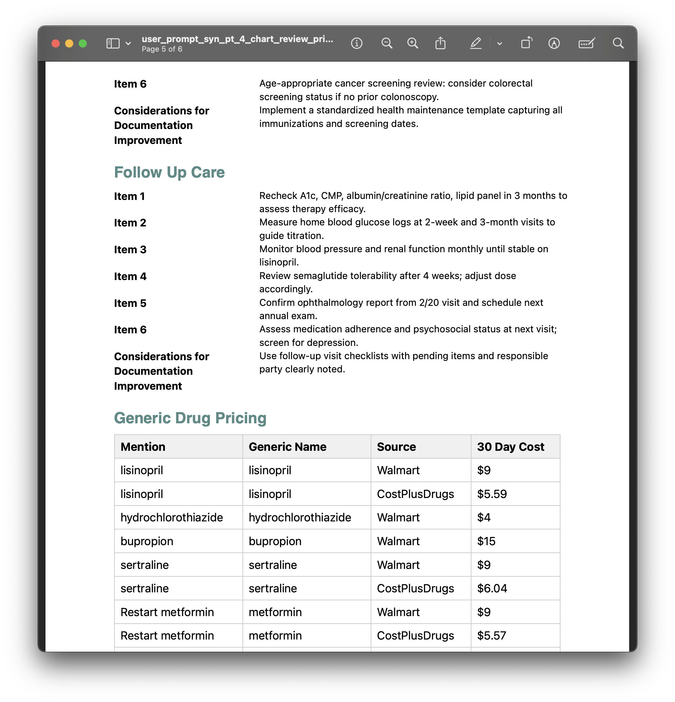
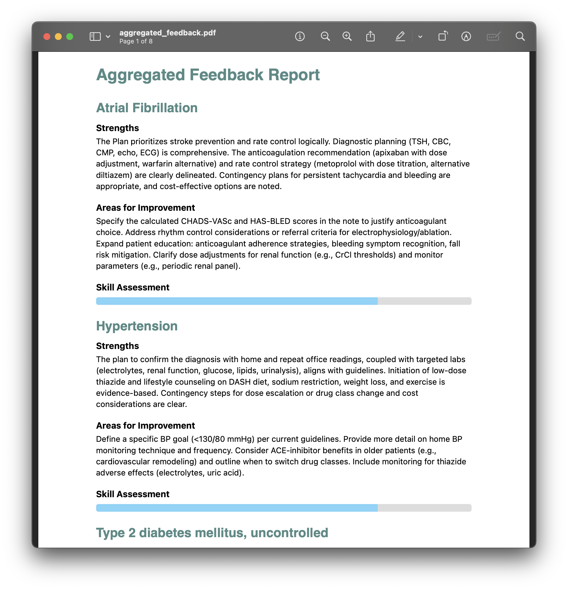
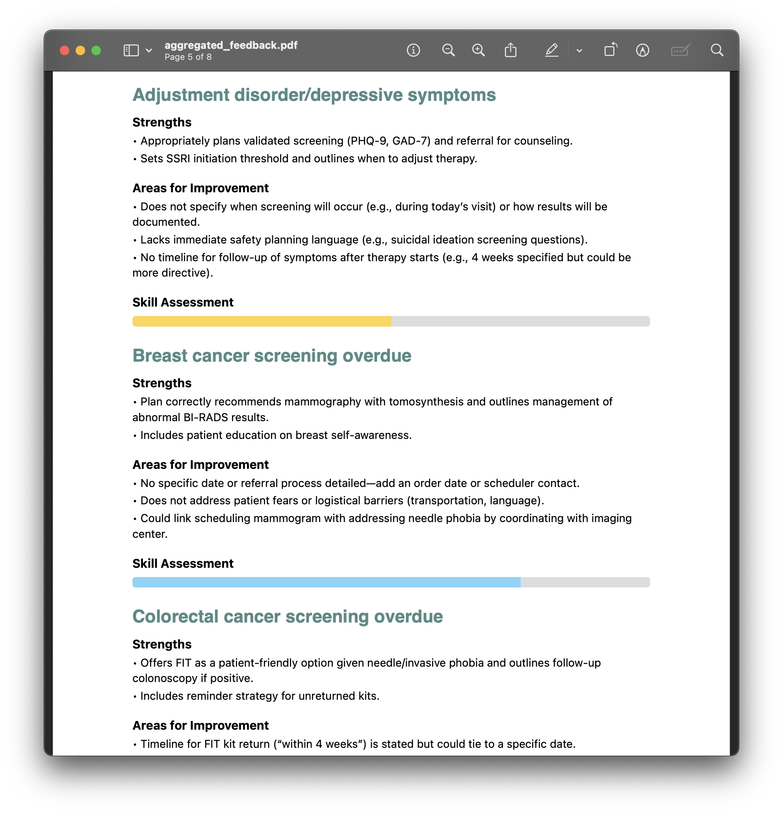

# Automate QuICR (Quality Improvement Chart Review)

Retrospective patient chart reviews of electronic medical records is a crucial process for quality improvement efforts that impact clinical care, medical billing (cost effective care), and internal compliance standards. However, the traditional process of using a team of physicians is time-consuming, labor-intensive, and requires training on a shared criteria to avoid inconsistencies. As a Generative AI fellow at [X = Primary Care](https://fellowship.xprimarycare.com/) (XPC) in Spring 2025, for my self-directed project I developed an end-to-end python app, QuICR, that automates chart review for the primary care clinical setting using natural language processing techniques.

## Value and Benefits
<b>Efficiency</b>
- 1-2 hours per chart review reduced to < 1 minute.
- Cost-effective: < $0.01 per chart review.
- Just hit "Enter" and the app does the rest. No repetitive copy-pasting.

<b>Constructive Feedback For Deliberate Practice</b>
- Supplies suggestions to improve the documentation of the chart for each documentation issue identified.
- Provides a birds-eye-view of all patient chart reviews to identify trends in a user's documentation practices and ranks the charts based on the severity of the documentation issue.

<b>Standardization and Consistency.</b>
- Reduces the variability in chart reviews by providing a structured and standardized criteria to identify documentation issues.
- Finds the generic names of medications and retrieves the price of the medicatons from Walmart's generic drug list and CostPlusDrugs to aid cost effective care.
- The insights are presented to the user in an organized and easy to read format provided in a web browser (HTML) and as a PDF for easy sharing with others.

## End-to-End App Overview
<table>
  <tr>
    <td align="center">
       
      The end-to-end workflow of QuICR involves the submission of (synthetic) patient data to the OpenAI API, locally run python code to parse the structured JSON based on my custom schema, SciScaCy with the Unified Medical Language System (UMLS) standardizes medication names for drug price look-up, and then generates the professionally organized reports in the HTML and PDF formats.
    </td>
  </tr>
</table>

## Demonstration of Outputs
### Chart Review on Synthetic Patient, Bill Moore (Click to image to enlarge or view [corresponding PDF](generated_output/o4-mini-2025-04-16/chart_review/pdf/user_prompt_syn_pt_4_chart_review_pricing.pdf).)
<table align="center">
  <tr>
    <td align="center" style="vertical-align: top;">
       
      All chart review reports begin with key highlights to give the reader an overview that is specific for that patient followed by chief concern and assessment.
    </td>
    <td align="center" style="vertical-align: top;">
       
      The plan section for all patients is separated by medical problem. For each problem it is broken down into subsections, status, decision making/diagnostic plan, treatment/medication plan, contingency planning, considerations for documentation improvement, and considerations for cost effective care improvement.
    </td>
    <td align="center" style="vertical-align: top;">
       
      The remainder of the document contains anticipatory preventative care, follow-up care, and generic drug pricing relevant to the patient.
    </td>
  </tr>
</table>

### Aggregate Documentation Report (Click to enlarge image or view [corresponding PDF](generated_output/o4-mini-2025-04-16/cr_feedback/aggregated_feedback.pdf).)
<table align="center">
  <tr>
    <td align="center" style="vertical-align: top;">
       
      The aggregate report compiles the constructive feedback for a given user/learner and gives a rating to indicate which areas of improvement require priority.
    </td>
    <td align="center" style="vertical-align: top;">
       
      In addition to compiling feedback for medical problem documentation, it provides suggestions for preventative health screenings.
    </td>
  </tr>
</table>

## Tools and Techniques Used 
<b>Natural Language Processing (NLP).</b>
- Prompt engineering.
  - System prompt path: `prompt/system/system_prompt_chart_review_2.txt`
- Structured Outputs and JSON Schemas.
  - [OpenAI’s Structured Outputs](https://platform.openai.com/docs/guides/structured-outputs?api-mode=responses) feature via the API *guarantees reliability* in complex, multi-step NLP tasks.
  - My custom specification of the JSON schemas enforces strict adherenece to the defined LLM responce format.
    - JSON schema path: `prompt/json_schema/`
- Named-Entity Recognition (NER).
   - Standardization of medications to generic names using [Unified Medical Language System](https://www.nlm.nih.gov/research/umls/index.html) (UMLS) linker via [SciSpaCy](https://github.com/allenai/scispacy).

<b>Dynamic Report Generation (UI/UX).</b>
- The [Jinja2](https://github.com/pallets/jinja/) templates I created define the visual organization (i.e., HTML structure) for the key highlights, problem plans, anticipatory health maintenance, and follow-up plan.
- [WeasyPrint](https://github.com/Kozea/WeasyPrint) renders the HTML to PDF with the custom CSS styles.
- Together, they create a professional report that is easy to read and share with others.

<b>Usage and Performance Monitoring.</b>
- The inference code captures token usage metrics to aid in monitoring cost and processing speed over time. For examples:
   - `generated_output/o4-mini-2025-04-16/usage`

<b>Reproducible Environment.</b>
- The environment is fully reproducible via the provided `myenv.yml` Conda specification, ensuring that all dependencies (Python, SciSpacy, WeasyPrint, etc.) can be installed consistently across Linux, macOS, and Windows.

## Usage
1. After cloning the repository, create a conda environment using the `myenv.yml` file. Activate the environment using the command `conda activate quicr`.
2. Assign your OpenAI API key to the `OPENAI_API_KEY` environment variable in your `.env` file. Note: this is separate from having a ChatGPT Plus account and one needs to add funds to their [OpenAI Platform](https://platform.openai.com/) account to use the API.
3. While in the root of the project directory, run the app using the command `python app.py` in your terminal.

## Data
Synthetic data that closely resemble primary care patient chart data (e.g., demographics, medications, lab results, and clinical notes) was used to test the feasibility of the app. This data was created by expert primary care physicians to represent the patient data they have encountered in their practice.

## Limitations Disclaimer
This is a functional application to demonstrate the value of the technologies and techniques used in my project. While the outputs are impressive, testing on numerous cases is required. In its current form, the app (and its componenets) are not intended to be used for clinical decision making without expert physician supervision or to replace human judgement in patient care. Walmart and CostPlusDrugs are not affiliated with this project and their mention in this project is not an endorsement; the prices of medications may vary by location, and are subject to change.

## Future Directions
Evaluation studies involving thousands of patient charts are needed to fully assess the performance of the app to capture the nuances of patient clinical presentations and the complexity of clinical decision making. Hybrid frameworks that evaluate GenAI outputs with human input and an LLM evaluator with a criteria set such as [EvalGen](https://arxiv.org/pdf/2404.12272) to assess the performance of the app. This approach is suitable because it allows for human judgement to be incorporated for nuanced cases and can aid in aligning the LLM evaluator with human appraisal as it processes a large number of charts faster than humans.

## Acknowledgements
I would like to thank Paulius Mui, M.D. (founder of X = Primary Care) for his mentorship and support throughout the fellowship.

# Contact
Morris A. Aguilar, Ph.D. 
XPC Generative AI Fellow, Spring 2025. 
morrisglr@proton.me 
@morrisglr.bsky.social