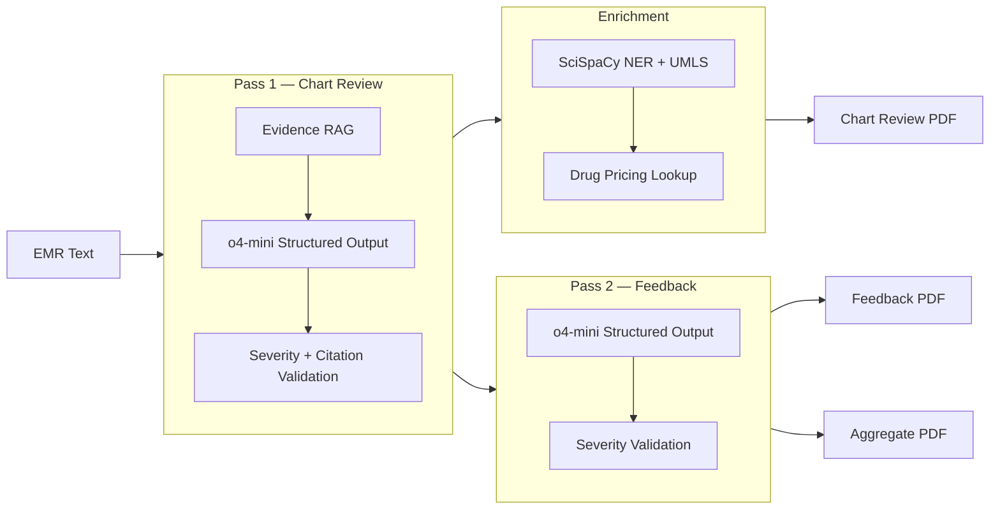
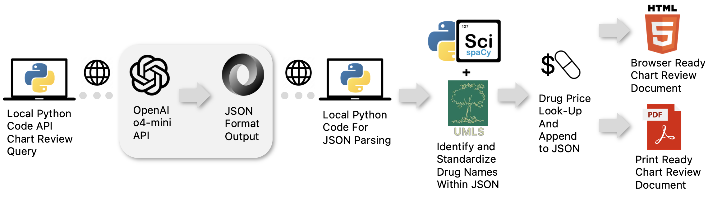
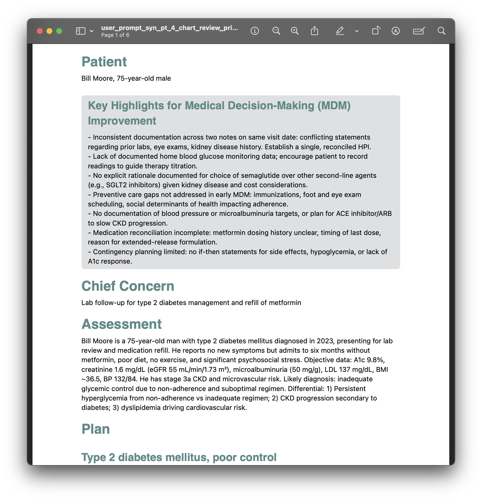
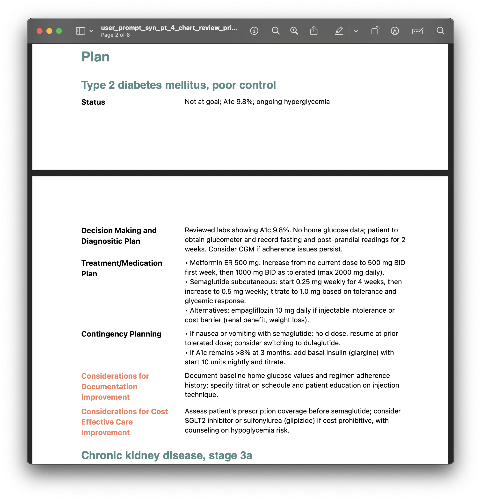
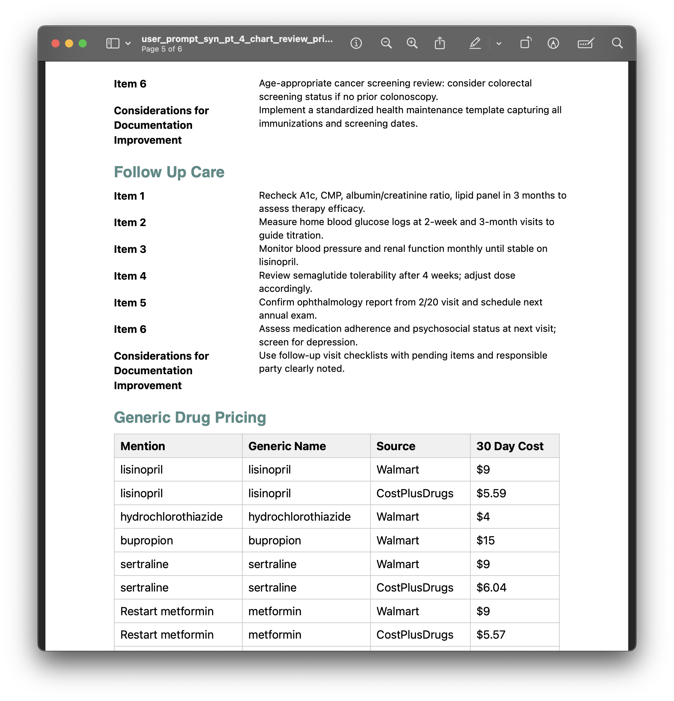
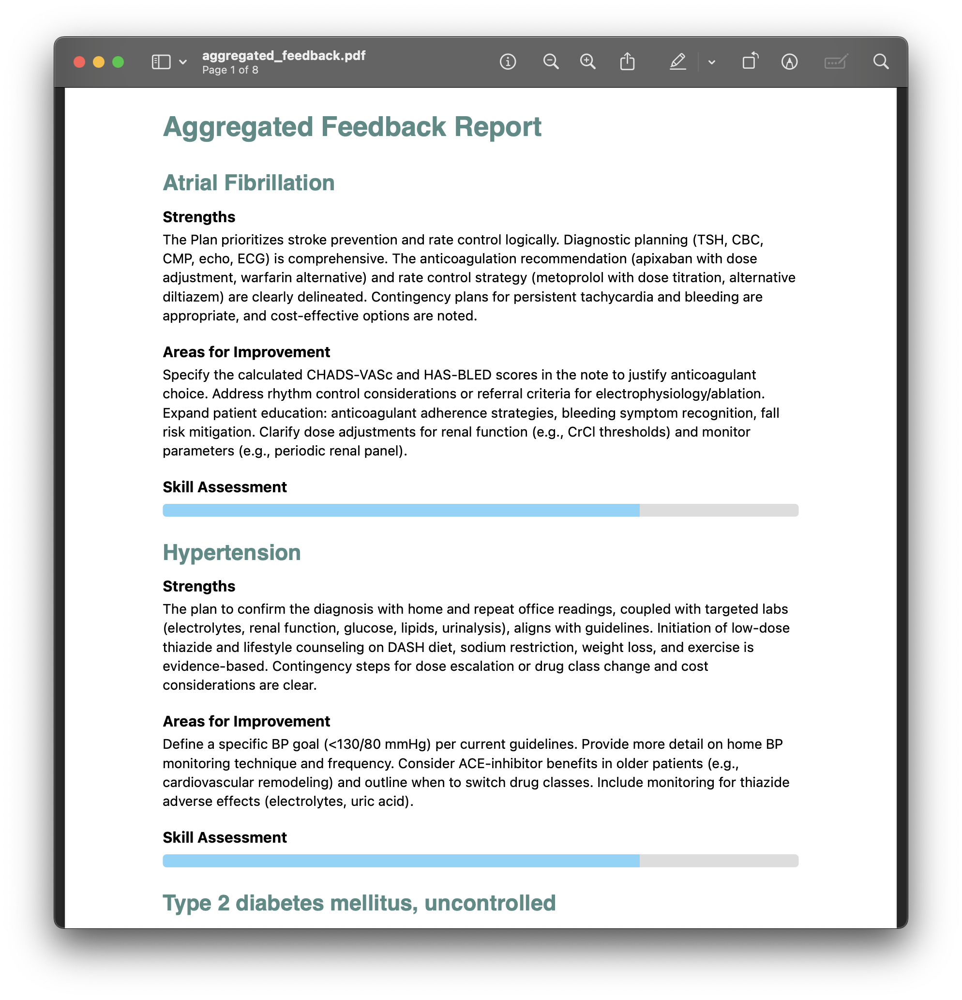
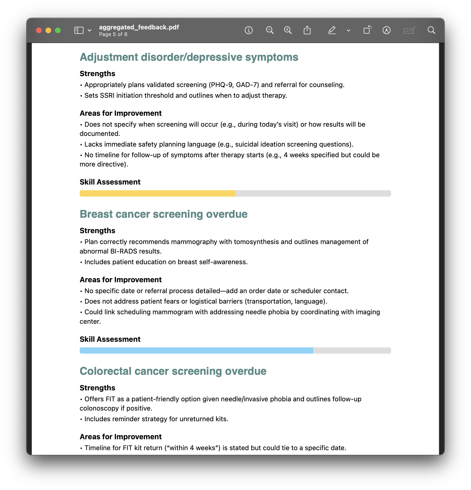

# Automate QuICR (<u>Qu</u>ality <u>I</u>mprovement <u>C</u>hart <u>R</u>eview)

[](LICENSE)
[](https://www.python.org/)

Retrospective patient chart reviews of electronic medical records is a crucial process for quality improvement efforts that impact clinical care, medical billing (cost effective care), and internal compliance standards. However, the traditional process of using a team of physicians is time-consuming, labor-intensive, and requires training on a shared criteria to avoid inconsistencies. As a Generative AI fellow at [X = Primary Care](https://fellowship.xprimarycare.com/) (XPC) in Spring 2025, for my self-directed project I developed an end-to-end python app, QuICR, that automates chart review for the primary care clinical setting using natural language processing techniques.

## Value and Benefits
### Efficiency
- 1-2 hours per chart review reduced to < 1 minute.
- Cost-effective: < $0.01 per chart review.
- Just hit "Enter" and the app does the rest. No repetitive copy-pasting.

### Constructive Feedback For Deliberate Practice
- Supplies suggestions to improve the documentation of the chart for each documentation issue identified.
- Provides a birds-eye-view of all patient chart reviews to identify trends in a user's documentation practices and ranks the charts based on the severity of the documentation issue.

### Standardization and Consistency
- Reduces the variability in chart reviews by providing a structured and standardized criteria to identify documentation issues.
- Finds the generic names of medications and retrieves the price of the medicatons from Walmart's generic drug list and CostPlusDrugs to aid cost effective care.
- The insights are presented to the user in an organized and easy to read format (inspired by Swiss design principles) provided in a web browser (HTML) and as a PDF for easy sharing.

## End-to-End App Overview

QuICR runs a two-pass LLM pipeline: the first pass generates a structured chart review from the EMR; the second pass uses both the EMR and chart review to produce per-problem feedback with skill assessments.


```mermaid
flowchart LR
    EMR[EMR Text]

    subgraph Pass1[Pass 1 — Chart Review]
        RAG[Evidence RAG] --> CR[o4-mini Structured Output] --> SEV[Severity + Citation Validation]
    end

    subgraph Enrich[Enrichment]
        NER[SciSpaCy NER + UMLS] --> DRUG[Drug Pricing Lookup]
    end

    subgraph Pass2[Pass 2 — Feedback]
        FB[o4-mini Structured Output] --> SEV2[Severity Validation]
    end

    EMR --> Pass1
    Pass1 --> Enrich
    Pass1 --> Pass2
    Enrich --> PDF1[Chart Review PDF]
    Pass2 --> PDF2[Feedback PDF]
    Pass2 --> PDF3[Aggregate PDF]
```

<div align="center">
  
  <p><sub>The medication enrichment workflow: SciSpaCy with the Unified Medical Language System (UMLS) standardizes medication names for drug price lookup across the Walmart generic drug list and CostPlusDrugs.</sub></p>
</div>

## Demonstration of Outputs
### Chart Review on Synthetic Patient, Bill Moore (Click an image to enlarge or view the [corresponding PDF](generated_output/o4-mini-2025-04-16/chart_review/pdf/user_prompt_syn_pt_4_chart_review_pricing.pdf).)

<div align="center">
  <a href="media/morris_aguilar_bill_chart_review_1.png">
    
  </a>
  <p><sub>All chart review reports begin with key highlights to give the reader an overview specific to that patient, followed by chief concern and assessment.</sub></p>
</div>

<div align="center">
  <a href="media/morris_aguilar_bill_chart_review_2.png">
    
  </a>
  <p><sub>The plan section separates each medical problem into subsections: status, decision making and diagnostic plan, treatment and medication plan, contingency planning, and considerations for documentation and cost-effective care improvement.</sub></p>
</div>

<div align="center">
  <a href="media/morris_aguilar_bill_chart_review_3.png">
    
  </a>
  <p><sub>The remainder of the report covers anticipatory preventative care, follow-up care, and a generic drug pricing table with Walmart and CostPlusDrugs prices relevant to the patient's medications.</sub></p>
</div>


### Aggregate Documentation Report (Click an image to enlarge or view the [corresponding PDF](generated_output/o4-mini-2025-04-16/cr_feedback/aggregated_feedback.pdf).)

<div align="center">
  <a href="media/morris_aguilar_aggregated_report_1.png">
    
  </a>
  <p><sub>The aggregate report compiles constructive feedback across all reviewed charts and assigns severity ratings to indicate which documentation areas require the most attention.</sub></p>
</div>

<div align="center">
  <a href="media/morris_aguilar_aggregated_report_3.png">
    
  </a>
  <p><sub>In addition to compiling problem-level feedback, the aggregate report surfaces cross-patient trends in preventative health screenings and anticipatory care.</sub></p>
</div>

## Tools and Techniques Used 
### Natural Language Processing (NLP)
- Prompt engineering.
  - System prompt path: `prompt/system/system_prompt_chart_review_2.txt`
- Structured Outputs and JSON Schemas.
  - [OpenAI’s Structured Outputs](https://platform.openai.com/docs/guides/structured-outputs?api-mode=responses) feature via the API *guarantees reliability* in complex, multi-step NLP tasks.
  - My custom specification of the JSON schemas enforces strict adherenece to the defined LLM responce format.
    - JSON schema path: `prompt/json_schema/`
- Named-Entity Recognition (NER).
   - Standardization of medications to generic names using [Unified Medical Language System](https://www.nlm.nih.gov/research/umls/index.html) (UMLS) linker via [SciSpaCy](https://github.com/allenai/scispacy).

### Dynamic Report Generation (UI/UX)
- The [Jinja2](https://github.com/pallets/jinja/) templates I created define the visual organization (i.e., HTML structure) for the key highlights, problem plans, anticipatory health maintenance, and follow-up plan.
- [WeasyPrint](https://github.com/Kozea/WeasyPrint) renders the HTML to PDF with the custom CSS styles.
- Together, they create a professional report that is easy to read and share with others.

### Usage and Performance Monitoring
- The inference code captures token usage metrics to aid in monitoring cost and processing speed over time. For examples:
   - `generated_output/o4-mini-2025-04-16/usage`

### Reproducible Environment
- The environment is fully reproducible via the provided `myenv.yml` Conda specification, ensuring that all dependencies (Python, SciSpacy, WeasyPrint, etc.) can be installed consistently across Linux, macOS, and Windows.

## Quick Start

```bash
conda env create -f myenv.yml && conda activate quicr
echo "OPENAI_API_KEY=your_key" > .env
python app.py --step all --overwrite
```

> **Note:** An [OpenAI Platform](https://platform.openai.com/) account with API credits is required (separate from ChatGPT Plus).


## Data
Synthetic data that closely resemble primary care patient chart data (e.g., demographics, medications, lab results, and clinical notes) was used to test the feasibility of the app. This data was created by expert primary care physicians to represent the patient data they have encountered in their practice.

## Limitations Disclaimer
This is a functional application to demonstrate the value of the technologies and techniques used in my project. While the outputs are impressive, testing on numerous cases is required. In its current form, the app (and its componenets) are not intended to be used for clinical decision making without expert physician supervision or to replace human judgement in patient care. Walmart and CostPlusDrugs are not affiliated with this project and their mention in this project is not an endorsement; the prices of medications may vary by location, and are subject to change.

## Future Directions
Evaluation studies involving thousands of patient charts are needed to fully assess the performance of the app to capture the nuances of patient clinical presentations and the complexity of clinical decision making. Hybrid frameworks that evaluate GenAI outputs with human input and an LLM evaluator with a criteria set such as [EvalGen](https://arxiv.org/pdf/2404.12272) to assess the performance of the app. This approach is suitable because it allows for human judgement to be incorporated for nuanced cases and can aid in aligning the LLM evaluator with human appraisal as it processes a large number of charts faster than humans.

## Acknowledgements
I would like to thank Paulius Mui, M.D. (founder of X = Primary Care) for his mentorship and support throughout the Spring 2025 fellowship.

## Citation

If you use QuICR in your research, please cite:

```bibtex
@software{aguilar2025quicr,
  author    = {Aguilar, Morris A.},
  title     = {Automate {QuICR} ({Q}uality {I}mprovement {C}hart {R}eview)},
  year      = {2025},
  version   = {0.1.0},
  url       = {https://github.com/MorrisGlr/Automate-QuICR},
  license   = {Apache-2.0}
}
```

# Contact
Morris A. Aguilar, Ph.D.<br>
XPC Generative AI Fellow, Spring 2025.<br>
<a href= https://www.linkedin.com/in/morris-a-aguilar/ >LinkedIn</a><br>
@morrisglr.bsky.social